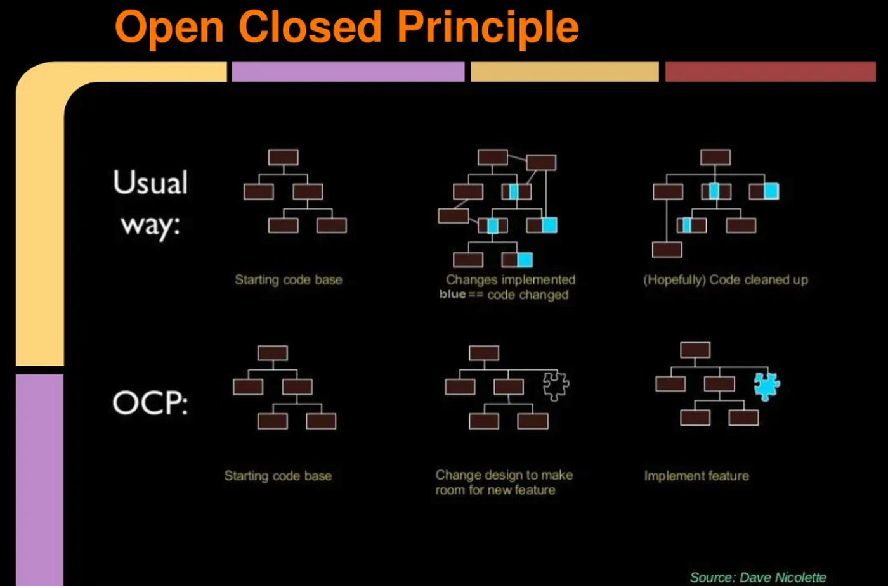
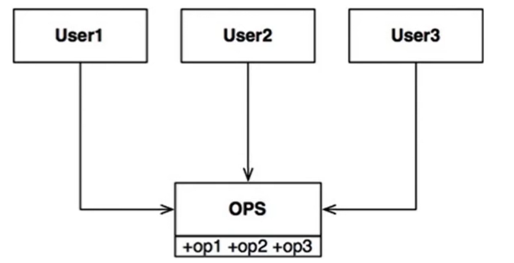

# SOLID
## Single Responsibility Principle (SRP) Example

The Single Responsibility Principle (SRP) is one of the SOLID principles in object-oriented programming. It states that a class should have only one reason to change, meaning it should have only one responsibility or job within the software system.

In the context of SRP, a "responsibility" is defined as a reason to change. By designing classes with a single responsibility, you improve the maintainability, readability, and flexibility of your code. Each class becomes focused on doing one thing and doing it well, making it easier to understand, modify, and extend.

When a class has multiple responsibilities, changes to one of those responsibilities can impact the other parts of the class, leading to a fragile and tightly coupled design. By adhering to SRP, you achieve a more modular and loosely coupled codebase, making it easier to manage and extend the software system.
### SRP Violation

In the `SOLID.SRP.ModelSRPViolation` namespace, there is a `Phone` class that implements the `IPhone` interface. However, this violates SRP as the `Phone` class has responsibilities related to both handling the phone connection (`Dial`, `Disconnect`) and data management (`Send`, `Receive`).

### SRP Solution

To address the SRP violation, the code presents a solution in the `SOLID.SRP.ModelSrpSolution` namespace. It introduces separate classes for connection management (`ConnectionManagerImplementation`) and data management (`DataManagerImplementation`), adhering to the SRP.

Additionally, the `PhoneSRP` class acts as a cohesive integration of the connection and data management components, adhering to SRP by separating concerns effectively.

### Employee Architecture

In the `SOLID.SRP.EmployeeArchitecture` namespace, an example of clean architecture and usage of various design patterns is provided. The code showcases a simplified employee management system.

### Report Formatting

- `ReportFormatter` and `EmployeeReportFormatter` demonstrate formatting an employee's information into XML or CSV formats, allowing for flexibility and maintainability.

### Employee Data Access Object (DAO)

- `EmployeeDAO` handles saving and deleting employee information, adhering to separation of concerns.

### Employee Class

- `Employee` class represents an employee entity with relevant attributes.

### Database Connection Management

- `DatabaseConnectionManager` demonstrates managing a database connection using Entity Framework Core, following best practices and encapsulating database-related functionalities.

### Client Module

- `ClientModule` provides methods for hiring and terminating employees, printing employee reports, and acting as an entry point for client interactions with the employee management system.

## Open-Closed Principle (OCP)

The Open-Closed Principle (OCP) is one of the SOLID principles in object-oriented programming. According to this principle, software entities such as classes, modules, functions, and so on, should be open for extension but closed for modification.

This means that the behavior of an entity can be extended by adding new code, but the existing code should not be altered. Thus, new functionality should be added using inheritance, interfaces, or other extension mechanisms without modifying the existing, working code.

This principle promotes creating flexible and change-resistant code, making it easier to maintain, extend, and reuse in various contexts.

### OCP Violation

In the `SOLID.OCP.SRPViolation` namespace, examples of violating the Open-Closed Principle (OCP) are demonstrated. This involves scenarios where the code requires modification and is not easily extensible when new functionalities are introduced.

### OCP Solution

In the `SOLID.OCP.SrpSolution.LoanOCPSolution` and `SOLID.OCP.SrpSolution.ShapeOCPSolution` namespaces, you can find examples of adhering to the Open-Closed Principle (OCP) by creating extensible and flexible code that allows for easy addition of new functionalities without modifying existing code.

## Liskov Substitution Principle (LSP)

The Liskov Substitution Principle (LSP) is one of the SOLID principles in object-oriented programming. It states that objects of a derived class should be able to replace objects of the base class without affecting the correctness of the program.

### LSP Violation

In the `SOLID.LSP.LSPViolation` namespace, there is an example demonstrating a violation of the Liskov Substitution Principle. This occurs in the `WinampMediaPlayer` class, which throws an exception when the `PlayVideo()` method is called. This is unacceptable behavior for the `MediaPlayer` abstraction.

### LSP Solution

In the `SOLID.LSP.LSPSolution` namespace, you can find an example of adhering to the Liskov Substitution Principle. Here, the `AudioMediaPlayer`, `VideoMediaPlayer`, `TorMediaPlayerLSP`, `VlcMediaPlayerLSP`, and `WinampMediaPlayerLSP` classes all inherit from the `MediaPlayerLSP` abstraction and provide the expected behavior, thus maintaining the Liskov Substitution Principle.
### Example with LSP Adherence

### Example Ciolating LSP

## Interface Segregation Principle (ISP)

The Interface Segregation Principle (ISP) is one of the SOLID principles in object-oriented programming. It emphasizes that clients should not be forced to depend on interfaces they do not use. In other words, it's better to have smaller, specific interfaces than a large, general one. This principle helps in achieving a more modular, maintainable, and flexible codebase.

### ISP Violation

In the `SOLID.ISP.ISPViolation` namespace, examples of violating the Interface Segregation Principle (ISP) can be found. For instance, in the `BirdISPViolation` namespace, the `IBird` interface is overly broad, forcing implementers to provide empty or meaningless implementations for methods not relevant to their specific bird type. This violates the principle of having interfaces that are client-specific and cohesive.

In the `OrderISPViolation` namespace, the `IOrderService` interface contains methods that may not be applicable to all clients. For example, an order service might not need to handle order processing directly. This violates the principle of segregating interfaces based on client needs.

### ISP Solution

In the `SOLID.ISP.ISPSolution` namespace, adherence to the Interface Segregation Principle (ISP) is demonstrated. For instance, in the `BirdISPSolution` namespace, specific interfaces like `IFly`, `IRun`, and `ISwim` are defined to represent specific behaviors, allowing clients to implement only what is relevant to their particular bird type.

In the `OrderISPSolution` namespace, the `IOrderService` interface is divided into more specific interfaces like `IOrderService` and `IOrderProcessingService`, adhering to the principle of providing smaller, client-specific interfaces.

This adherence to the ISP leads to cleaner, more maintainable code, and prevents unnecessary dependencies for clients that do not require certain functionalities.
### Example with ISP Adherence

### Example Violating LSP
